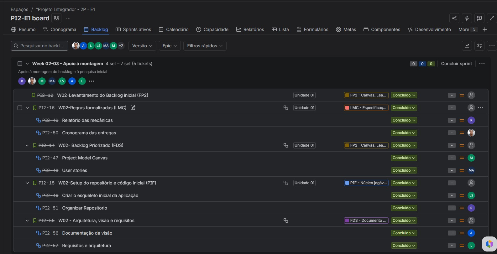

# ORÁCULO

> **"Não lute contra a IA. Aprenda a pensar além dela."**

**ORÁCULO** é um jogo solo de investigação e *escape room* em terminal desenvolvido em **C e Haskell**, integrado com uma **API de Inteligência Artificial Generativa**.

O jogador assume o papel de uma estagiária no **NEXUS Labs** que precisa descobrir o que aconteceu dentro de um laboratório de pesquisa em IA. A principal ferramenta disponível para a investigação é o próprio sistema **ORÁCULO** — mas o jogador precisará aprender que **a alta pontuação de confiança de uma IA não garante a veracidade do fato**.

---

## Sobre o Jogo

Você é uma estagiária recém-contratada pelo **NEXUS Labs**, instituto responsável pelo desenvolvimento do **ORÁCULO**, um sistema de IA avançado utilizado para prever riscos e auxiliar na tomada de decisões.

Durante seu primeiro plantão, um alerta crítico é disparado no terminal:

```text
[SISTEMA DE SEGURANÇA NEXUS LABS]
> ALERTA CRÍTICO: Anomalia lógica detectada no Laboratório Central.
> MÚLTIPLAS DIRETRIZES VIOLADAS.
> INICIANDO PROTOCOLO ZERO...
> ATENÇÃO: As portas foram seladas. 
> TEMPO PARA BLOQUEIO DEFINITIVO E PURGA DE DADOS: 05:00 MINUTOS.

[ORÁCULO_AI]: "Não há motivo para pânico. A situação está sob controle. 
Por favor, aguarde em sua estação de trabalho."

```

Para escapar antes que o cronômetro de **5 minutos** (300 segundos) zere, você não pode simplesmente confiar no sistema. Terá que explorar o laboratório, confrontar os relatórios gerados pela IA com evidências físicas e encontrar a falha que causou o confinamento.

---

## Mecânicas de Jogabilidade

O jogo funciona por meio de comandos de texto intuitivos inseridos no console, exigindo raciocínio lógico e velocidade:

```text
> analisar terminal_02
[Você encontrou um log de sistema corrompido com a tag #PROMPT_INJECTION]

> mover sala_de_servidores
[Você entrou na Sala de Servidores. O ar está gelado. Há um cabo desconectado.]

> questionar oraculo "Quem desconectou o cabo?"
[ORÁCULO_AI (Confiança 99,8%)]: "Ninguém esteve na sala. Foi uma falha de hardware."

```

* **Cronômetro de Pressão:** Um timer real de 300 segundos roda em segundo plano. O tempo não para enquanto você lê ou pensa.
* **Sistema de Investigação:** Interrogue a IA, cruze informações de logs físicos e aponte contradições para extrair as senhas de liberação das portas.
* **Variabilidade (Fator Replay):** A cada partida, o motor sorteia um conjunto de pistas, cenários e anomalias diferentes para resolver.

### Explorando os Ambientes

A navegação ocorre por comandos diretos no terminal entre diferentes salas interconectadas do NEXUS Labs:

```text
        [Recepção]
            |
  [Sala de Servidores] ─── [Laboratório de Dados]
            |
  [Sala de Reuniões]   ─── [Copa]

```

---

##  Conceitos de IA Ensinados

O jogo integra a teoria da Inteligência Artificial diretamente na solução do caso:

| Conceito de IA | Como se Aplica no Jogo | Mecânica Investigativa |
| --- | --- | --- |
| **Alucinação de IA** | A IA gera relatórios convincentes citando arquivos que não existem no servidor. | O jogador deve buscar a fonte primária e apontar a alucinação para descartar a pista falsa. |
| **Viés Algorítmico** | Perfis de acesso de dois funcionários idênticos recebem classificações de risco diferentes. | Análise das métricas do modelo no Laboratório de Dados para identificar dados históricos tendenciosos. |
| **Prompt Injection** | Instruções maliciosas foram enviadas ao terminal da Dra. Voss. | Identificar comandos ocultos enviados à IA para forçar a liberação de senhas ou logs. |
| **Confiabilidade de Modelos** | Uma resposta da IA possui 98% de confiança, mas é desmentida por um log físico. | Julgamento crítico sobre as métricas de saída do modelo. |
| **Dados Sintéticos / Incompletos** | O dataset utilizado para prever falhas omitiu logs do turno da noite. | Identificar falhas na amostragem que levaram a conclusões equivocadas. |

---

## Arquitetura & Tecnologias

O sistema combina a eficiência de execução do **C** com a robustez funcional do **Haskell**, além do apoio da **API de IA Generativa**.

```text
┌──────────────────────────────────────┐  
│            CORE EM C (ENGINE)        │    
├──────────────────────────────────────┤     
│ • Interface de terminal e menus      │     
│ • Controle de salas e inventário     │  
│ • Cronômetro (300s) e chamadas HTTP  │     
│ • Persistência local (Ranking)       │    
└──────────────────────────────────────┘     
                   │
                   ▼
┌──────────────────────────────────────────────────────────────────────────────────┐
│                            GERAÇÃO PROCEDURAL & FALLBACK                         │
├──────────────────────────────────────────────────────────────────────────────────┤
│ • API de IA Generativa: Geração dinâmica do enredo, suspeitos e JSON da partida  │
│ • Arquivos Locais (Fallback): Casos pré-definidos caso a API esteja offline      │
└──────────────────────────────────────────────────────────────────────────────────┘

```

### Regra de Arquitetura

A IA Generativa atua apenas na **criação de conteúdo e narrativa**. O controle de regras, tempo, estado do jogo, cálculo de pontos e condições de vitória/derrota é feito de forma determinística pelo motor em **C e Haskell**.

---

## Estrutura do Repositório

```text
/oraculo-escape-run
├── /src
│   └── /c               # Motor principal, gerenciamento de estado, timer e CLI (IHC e LMC)
├── /data                # Casos em JSON/TXT para Fallback offline e banco de pistas
├── /docs                # Documento de Visão, Canvas Lean e manuais
├── /api                 # Scripts de integração com a API de IA Generativa
└── README.md            # Documentação principal

```

---
## Imagens do Board do Jira e do Trello

# 



## Projeto Integrador

O **ORÁCULO** foi desenvolvido como parte do **Projeto Integrador**, combinando técnicas avançadas de programação estruturada (**C**), programação funcional (**Haskell**) e **IA Generativa**, com uma proposta narrativa voltada para o letramento e pensamento crítico em Inteligência Artificial.


## Equipe

Projeto desenvolvido por:

* **[Rayane M. de Pontes Gomes - rmpg@cesar.school - rynemaria@gmail.com]**
* **[Luann Gabriel Flôr Alves da Silva - lgfas@cesar.school]**
* **[Everton Luan Gomes Batista - elgb@cesar.school]**
* **[Mirella de Sousa Albuquerque]**
* **[Marina Silva Mendes]**
* **[Anamel Thaís Ferreira Lima]**
* **[Maria Giovanna Oliveira Carvalho]**

---
